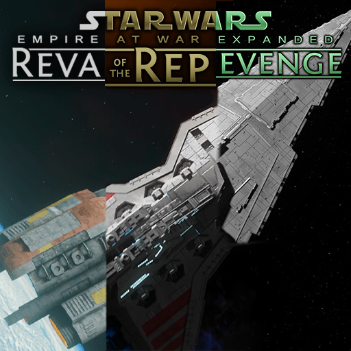

**Disclaimer**: This project is not affiliated with the EaWX team.

# eawx-enable-cheats

Enable built-in cheats for any EaWX mod, available in the *advanced options* tab.

## Cheat Options

To be clear, all these cheats are already in the EaWX mods (hidden by default).
This convenience plugin instantiates the appropriate options handler, instead of having to manually edit the file.

| Cheat Name            | Description |
|-----------------------|-------------|
| **Disable AI**        | Sets all non-human factions to AI player "None" (toggleable). |
| **Give Credits**      | Gives player 100,000 credits. |
| **Give Unit**         | Spawns a supremely powerful ground & space unit over the selected planet (orbit must be secure). |
| **Give Vision**       | Gives galactic vision (toggleable). |
| **Government**        | TR: Immediately give Dark Empire to a faction of your choice; FOTR: Immediate effect of 100 Senate approval; REV: N/A. |
| **Influence**         | Sets Influence to 10 on your planets (toggleable). |
| **Infra and Discount**| Gives 99% discount to build cost & time for everything; gives +10k pop cap per planet; turns off Infrastructure effects (toggleable). |
| **Kill All**          | Kills all units and structures for non-player factions, except heroes and Primary Starbases. |
| **Turn Off Crews**    | Turns off crew requirements (toggleable). |
| **Victory**           | Wins the campaign. |

**Note:** The `Government` option is not available in FotR 1.5.

## Supported Mods

- [Thrawn's Revenge](https://steamcommunity.com/sharedfiles/filedetails/?id=1125571106)
  **3.5**
- [Fall of the Republic](https://steamcommunity.com/sharedfiles/filedetails/?id=1976399102)
  **1.5**
- [Revan's Revenge](https://steamcommunity.com/sharedfiles/filedetails/?id=3417277973)
  **0.5**

# License

All **original code** authored in this project is available under the [MIT License](LICENSE).

This repository depends on files derived from **EaWX mods**.
See [ASSETS.md](ASSETS.md) for details on third-party content and asset usage.

### Workshop Content

The `mod/` directory contains the files uploaded to the Steam Workshop.

# Credits

Thanks to the EaWX team for creating and maintaining the EaWX mods.
